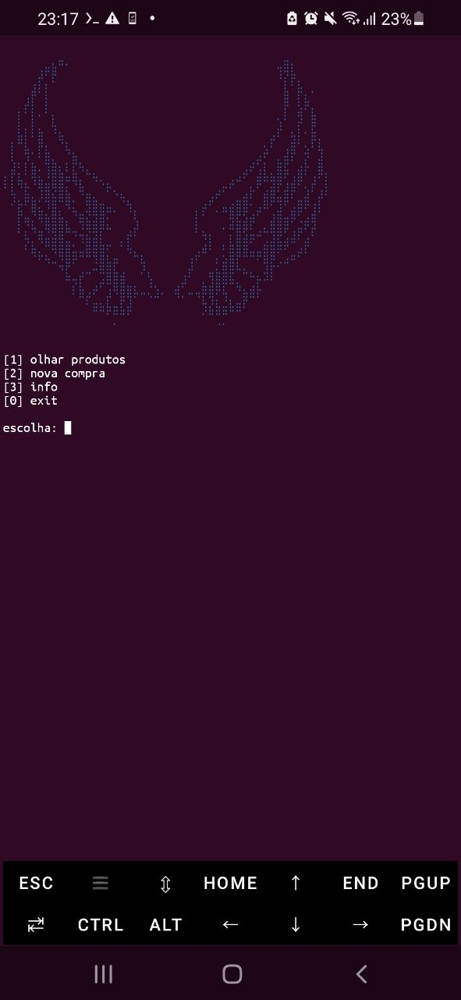
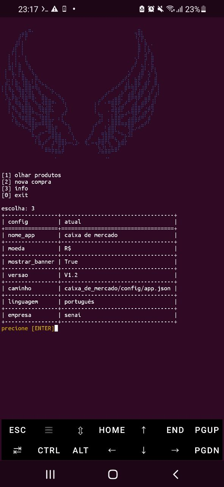
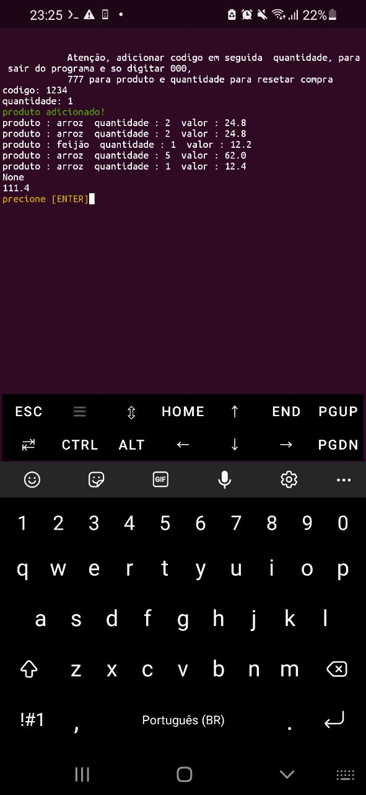
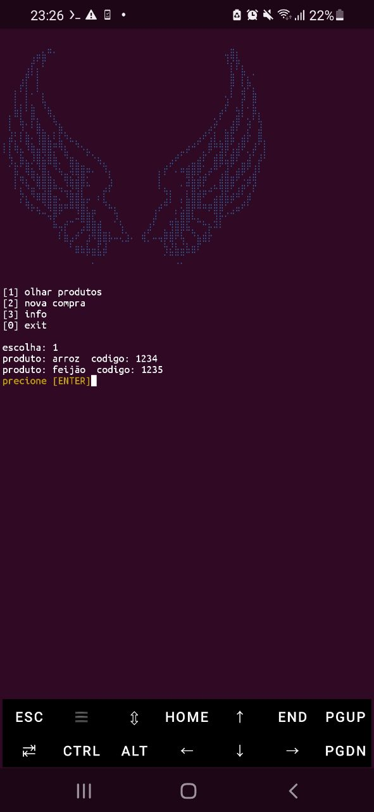

# Caixa de Mercado 🛒

Sistema simples de caixa de mercado feito em Python para registrar compras, visualizar produtos e calcular totais.

## 📌 Sobre o projeto

O **Caixa de Mercado** é um projeto feito para praticar:

* Organização de código em módulos;
* Manipulação de arquivos JSON;
* Estruturação de projetos Python;
* Uso de classes;
* Interface em terminal.

O sistema permite:

✅ Visualizar mercadorias cadastradas
✅ Adicionar produtos ao carrinho
✅ Calcular total da compra
✅ Configuração personalizada por JSON

---

## 📂 Estrutura do projeto

```bash
Caixa_de_mercado/
│
├── config/
│   └── app.json
│
├── core/
│   ├── __init__.py
│   ├── adicionar.py
│   ├── apagar.py
│   └── carregar.py
│
├── dados/
│   ├── __init__.py
│   ├── SQL.json
│   └── mercadorias.json
│
├── src/
│   ├── __init__.py
│   ├── carrinho.py
│   └── visualizar.py
│
├── README.md
└── start.py
```

---

## ⚙️ Tecnologias usadas

* Python 3
* JSON
* Colorama

---

## 📥 Instalação

Clone o repositório:

```bash
git clone https://github.com/ErikAndGabriel/Caixa_de_mercado.git
```

Entre na pasta:

```bash
cd Caixa_de_mercado
```

Instale as dependências:

```bash
bash install.sh
```

Execute o arquivo principal:

```bash
python start.py
```

---

## 📁 Explicação das pastas

### `config/`

Armazena configurações do sistema.

Exemplo:

* Nome do app
* Moeda
* Exibir banner

---

### `core/`

Funções auxiliares do sistema.

Exemplo:

* Carregar arquivos JSON
* Adicionar dados
* Limpar a tela 

---

### `dados/`

Arquivos JSON usados pelo sistema.

Exemplo:

* Produtos cadastrados
* Banco de dados da compra atual

---

### `src/`

Arquivos principais com a lógica do sistema.

Exemplo:

* Carrinho
* Visualização

---

---

## 📸 Screenshots

### 🏠 Menu principal

<p align="center">
  
</p>

Tela inicial do sistema com as opções principais.

---

### ⚙️ Informações do sistema

<p align="center">
  
</p>

Visualização das configurações do sistema como moeda, idioma e informações gerais.

---

### 🛒 Teste de compra

<p align="center">
  
</p>

Área para adicionar código do produto e quantidade desejada.

---

### 📦 Produtos disponíveis

<p align="center">
  
</p>

Lista de mercadorias cadastradas e seus respectivos códigos.

---
## 🎯 Objetivo do projeto

Este projeto foi criado para aprendizado e prática em:

* Python modular
* Programação orientada a objetos
* Manipulação de arquivos
* Organização profissional de projetos

---

## 👨‍💻 Autor

Desenvolvido por **Erik**

GitHub: https://github.com/ErikAndGabriel
